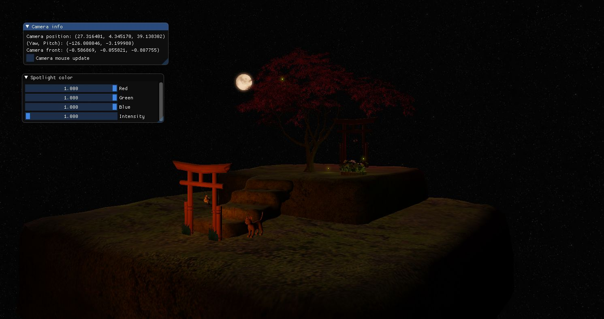
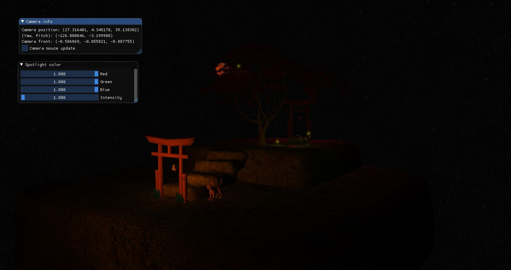
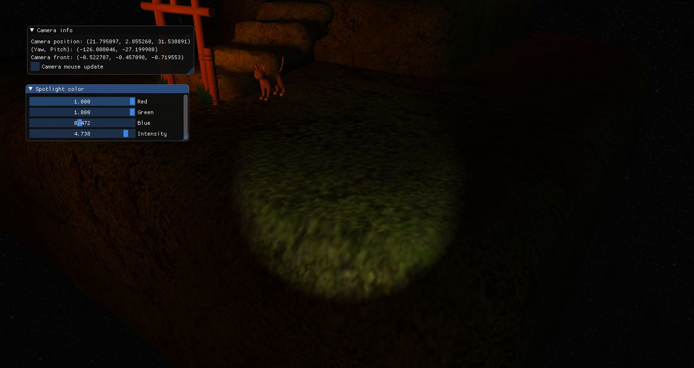

# Blood Moon

[JoeyDeVries](https://github.com/JoeyDeVries) - [LearnOpenGL](https://github.com/JoeyDeVries/LearnOpenGL)  
[spaske00](https://github.com/spaske00)- [Project base](https://github.com/matf-racunarska-grafika/project_base/)

[Demo video](https://www.youtube.com/watch?v=UOYtS_ToGcw)

# Resources
- Download objects: https://drive.google.com/file/d/1hlqk8yHhCBLO4OGzDWDMX6K7VsBZlIzI/view?usp=sharing
- Extract to `matf-rg-blood-moon/resources`

# Keyboard instructions:

`W` / `S` / `A` / `D` - camera movement  
`LEFT` / `RIGHT` / `UP` / `DOWN` - camera rotation  
`B` - blood moon on/off  
`ESC` - exit

# Implemented
- Required:  
  - Weeks 1-8  
  - Blending (discard)  
  - Face culling  
  - Advanced lighting  
- Group A:  
  - Cubemaps  
- Group B:  
  - HDR, Bloom  

# Models used
- Platforms: https://www.cgtrader.com/free-3d-models/exterior/landscape/stone-platforms-moss-1
- Torii: https://www.cgtrader.com/free-3d-models/architectural/other/low-resolution-old-torii
- Lamp: https://archive3d.net/?a=download&id=d4326772
- Tree: https://archive3d.net/?a=download&id=ee6ee750
- Flowers: https://archive3d.net/?a=download&id=cd86564b
- Moon: https://sketchfab.com/3d-models/the-moon-9916fcec59f04b07b3e8d7f077dc3ded
- Cat: https://www.cadnav.com/3d-models/model-48009.html

# Preview

